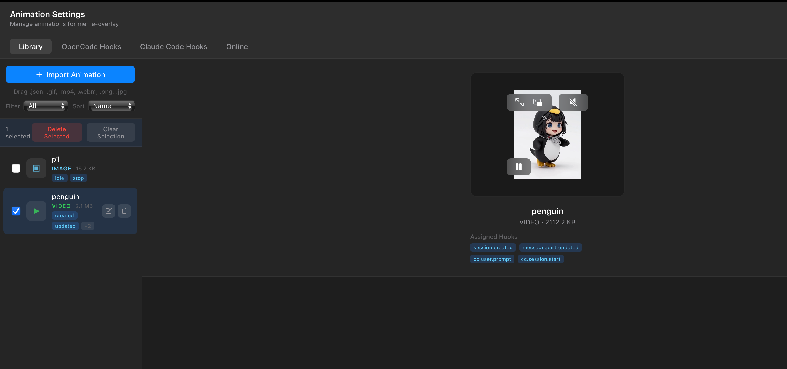
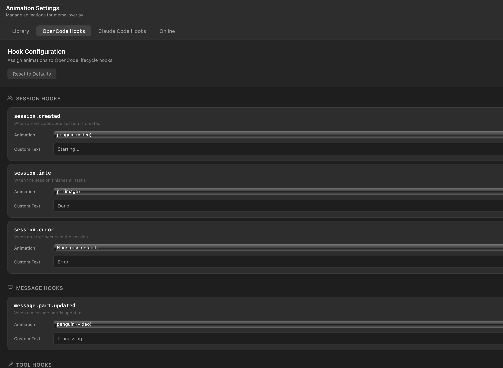
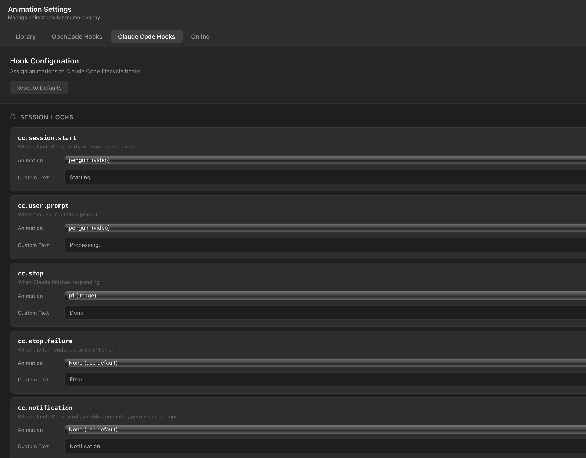

# meme-overlay

<p align="center">
  
  
  
  
</p>

<p align="center">
  A floating animation overlay desktop app for AI coding assistants
</p>

<p align="center">
  <a href="./README.md">中文</a> | English
</p>

---

## ✨ Introduction

meme-overlay is a lightweight desktop application built with [Tauri v2](https://tauri.app) that provides a floating animation overlay for [OpenCode](https://github.com/sst/opencode) and [Claude Code](https://docs.anthropic.com/en/docs/claude-code).

The demonstration animation is shown below：

[](https://youtu.be/_Oct2kNKrAg)

It consists of three core components:
- **Overlay window** — Transparent, always-on-top, draggable animation display
- **Settings window** — Animation management, hook configuration, online resource search
- **System tray** — Quick access to settings and exit

---

## ✨ Features

### Overlay

- Transparent background, always on top
- Freely draggable positioning
- Supports Lottie / GIF / MP4 / Image animations
- Real-time task progress text display
- Automatic response to plugin commands

### Settings Panel

- 📁 Import custom animations (Lottie JSON / GIF / MP4 / Images)
- 🎨 Assign separate animations for OpenCode and Claude Code hooks
- ✏️ Customize display text for each hook
- 🔄 Search and import animations from LottieFiles online
- 🗂️ Animation library management (rename, delete, batch operations)
- 🌐 Bilingual interface (Chinese / English)

### Supported Animation Formats

| Format | Extension | Description |
|--------|-----------|-------------|
| Lottie | `.json` | Vector animation, small size, smooth rendering |
| GIF | `.gif` | Animated images |
| Video | `.mp4`, `.webm` `.mov` | Video files |
| Image | `.png`, `.jpg` | Static images |

---

## 📝 Changelog

### 2026-04-01

#### ✨ New Features

- **Animation Movement** — Overlay now supports horizontal and vertical movement animations while displaying
- **Movement Speed Control** — Configurable animation speed for each hook
- **Custom Movement Path** — Draw custom movement trajectories using an interactive canvas editor
- **Path Optimization** — Automatic path smoothing and simplification algorithm for better performance
- **Advanced Hook Configuration** — Extended settings panel with movement direction, speed, and custom path options per hook

#### 🐛 Bug Fixes

- Fix abnormal movement behavior during idle hook animation transitions

---

## 📦 Installation

**Supported Platforms**: macOS (Intel/Apple Silicon) · Windows (x64)

### macOS (recommended)

```bash
npm install -g meme-overlay
```

The postinstall script automatically downloads the platform-specific binary to `~/.config/meme-overlay/bin/`.

For the Settings UI (double-click to open settings), download the server DMG for your architecture from [GitHub Releases](https://github.com/wuyouMaster/meme-overlay/releases):

| Architecture | File |
|---|---|
| Apple Silicon | `meme-overlay-server-aarch64-apple-darwin.dmg` |
| Intel | `meme-overlay-server-x86_64-apple-darwin.dmg` |

### Windows

```bash
npm install -g meme-overlay
```

Then download `meme-overlay-server-x86_64-pc-windows-msvc.exe` from [GitHub Releases](https://github.com/wuyouMaster/meme-overlay/releases) and place it in the same directory as `meme-overlay.exe` (located at `%USERPROFILE%\.config\meme-overlay\bin\`). Double-click the server exe to open the Settings UI.

### Setting Up Animations

Double-click the meme-overlay app to open the Settings page. The Settings page allows you to import local animation resources and configure corresponding animations for different lifecycle events.

#### 1. Import Animation Resources



#### 2. Configure OpenCode Animations



#### 3. Configure Claude Code Animations




## 🚀 Usage

### Using with OpenCode

1. See documentation [opencode-meme](https://github.com/wuyouMaster/opencode-meme)

### Using with Claude Code

1. See documentation [cc-meme](https://github.com/wuyouMaster/cc-meme)

### Build from Source

**Prerequisites**: [Rust](https://rustup.rs/) 1.77+ · [Node.js](https://nodejs.org/) 18+

```bash
git clone https://github.com/wuyouMaster/meme-overlay.git
cd opencode-overlay

# Install frontend dependencies
npm install

# Build
make build

# Install to ~/.config/meme-overlay/
make install
```

### Development Mode

```bash
# Start development mode (hot reload)
make dev

# Type checking
make check
```

---

### System Tray

Right-click the system tray icon:
- ⚙️ **Open Settings** — Manage animations and hook configuration
- 🚪 **Exit** — Close the overlay application

---

## ⚙️ Configuration

### Directory Structure

```
~/.config/meme-overlay/
├── config.json              # Hook animation assignment config
├── bookmarks.json           # macOS Security-Scoped Bookmarks
├── animations/              # Custom animation files directory
│   ├── coding.json
│   ├── thinking.gif
│   └── success.mp4
└── bin/
    └── meme-overlay         # Executable
```

### config.json

```json
{
  "opencode": {
    "hook_assignments": {
      "session.created": {
        "animation": "thinking",
        "custom_text": "Starting..."
      },
      "session.idle": {
        "animation": "success",
        "custom_text": "Done"
      }
    }
  },
  "cc": {
    "hook_assignments": {
      "cc.session.start": {
        "animation": "thinking",
        "custom_text": "Starting..."
      },
      "cc.stop": {
        "animation": "success",
        "custom_text": "Done"
      }
    }
  }
}
```

---

## 🛠️ Development

### Project Structure

```
opencode-overlay/
├── src/                        # React frontend source
│   ├── animations/             # Default animation data
│   ├── hooks/                  # React hooks
│   ├── i18n/                   # Internationalization (CN/EN)
│   ├── styles/                 # Stylesheets
│   └── windows/
│       ├── overlay/            # Overlay window components
│       └── settings/           # Settings window components
├── src-tauri/                  # Rust backend source
│   ├── src/                    # Tauri commands and state management
│   ├── capabilities/           # Tauri permission config
│   └── tauri.conf.json         # Tauri configuration
├── overlay.html                # Overlay entry HTML
├── settings.html               # Settings entry HTML
├── Makefile                    # Build scripts
├── vite.config.ts              # Vite configuration
└── package.json
```

### Common Commands

```bash
# Development mode
make dev

# Type checking (TypeScript + Rust)
make check

# TypeScript only
make check-ts

# Rust only
make check-rust

# Release build
make build

# Debug build
make build-dev

# Install to system
make install

# Clean build artifacts
make clean
```

### Cross-platform Build

```bash
# macOS Apple Silicon
make build TARGET=aarch64-apple-darwin

# macOS Intel
make build TARGET=x86_64-apple-darwin

# Linux x64
make build TARGET=x86_64-unknown-linux-gnu

# Windows x64
make build TARGET=x86_64-pc-windows-msvc
```

### Architecture

```
┌──────────────────────────────┐
│     Plugin (cc/opencode)      │
│         stdin JSON            │
└──────────────┬───────────────┘
               │
               ▼
┌──────────────────────────────┐
│      Tauri v2 App (Rust)      │
│  ┌────────────────────────┐  │
│  │   Overlay Window       │  │  ← Transparent, on-top, draggable
│  │   React + lottie-web   │  │
│  └────────────────────────┘  │
│  ┌────────────────────────┐  │
│  │   Settings Window      │  │  ← Animation mgmt, hook config
│  │   React                │  │
│  └────────────────────────┘  │
│  ┌────────────────────────┐  │
│  │   System Tray          │  │  ← Quick access
│  └────────────────────────┘  │
└──────────────────────────────┘
```

---

## 🔧 Troubleshooting

| Issue | Steps |
|-------|-------|
| App won't start | Check Rust version is 1.77+, run `rustup update` |
| Build fails | Run `make clean && npm install && make build` |
| Overlay not transparent | macOS requires `macOSPrivateApi` (pre-configured) |
| Animations not playing | Check animation file format, check console errors |
| Windows Settings won't open | Make sure you downloaded `meme-overlay-server-*.exe` from GitHub Releases and placed it in the same directory |
| npm install download fails | Download binary manually from [GitHub Releases](https://github.com/wuyouMaster/meme-overlay/releases) and place it at `~/.config/meme-overlay/bin/` |
---

## 📄 License

[MIT](LICENSE)
